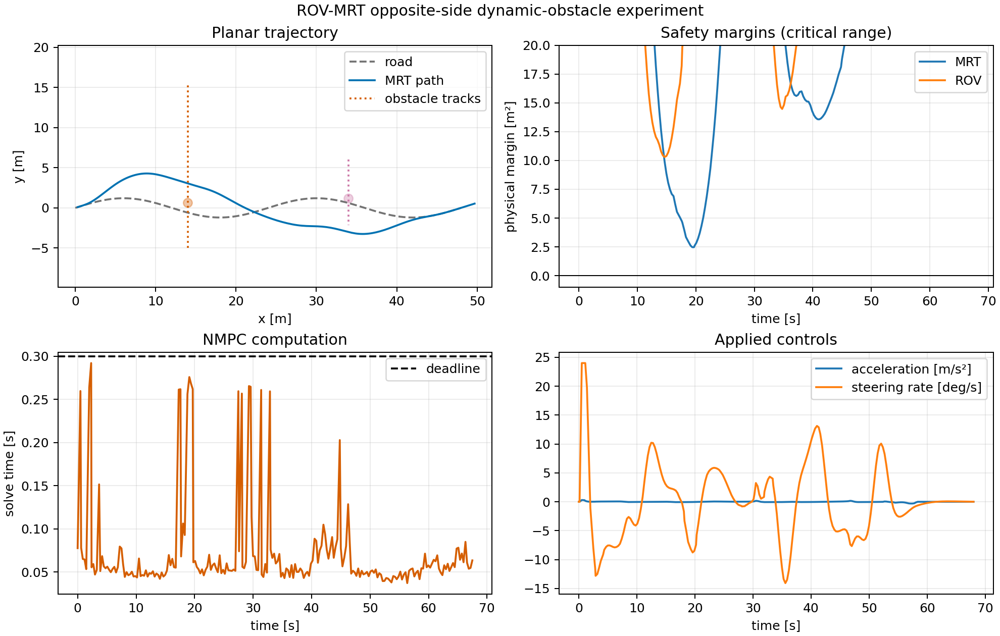

# ROV-MRT NMPC Dynamic-Obstacle Demo

[中文说明](README_zh-CN.md)

A reproducible ROS 2 Jazzy simulation of nonlinear model predictive control
(NMPC) for planar path tracking and dynamic-obstacle avoidance by an
articulated ROV-MRT deep-sea mining vehicle.

The default scenario follows an S-shaped road, predicts two
constant-velocity obstacles, and executes a prescribed opposite-side
avoidance corridor: pass the first obstacle on one side, transition smoothly,
pass the second on the other side, and return to the road.

> Research-demo scope: this repository demonstrates a complete controller,
> simulator, visualization, recording, and analysis pipeline. It is not a
> certified collision-avoidance system or a general-purpose motion planner.

## What is included

- Five-state articulated-vehicle kinematics with RK4 integration.
- CasADi/IPOPT NMPC with speed, steering, acceleration, and steering-rate limits.
- Three-circle MRT and two-circle ROV collision envelopes.
- Constant-velocity prediction for two moving circular obstacles.
- Soft padded-clearance constraints plus non-slackened hard-clearance constraints.
- RViz visualization of the road, prediction horizon, vehicle envelope, and obstacles.
- rosbag-to-CSV analysis, CSV-only metric reproduction, and overview plotting.
- A parameter file that reproduces the validated opposite-side scenario.
- ROS-independent unit tests for kinematics, geometry, and corridor generation.

## Reference result

The included CSV files under `results/opposite_side/` come from the validated
ROS 2 run `opposite_side_20260912_190205` (226 NMPC solves):

| Metric | Recorded value |
|---|---:|
| Minimum MRT physical margin | 2.468911 m² |
| Minimum ROV physical margin | 10.298939 m² |
| Maximum safety slack | 2.741579e-05 m² |
| Maximum constraint violation | 0 |
| Mean / 95th-percentile solve time | 0.072215 / 0.259505 s |
| Maximum solve time | 0.292165 s |
| Solves over the 0.30 s deadline | 0 / 226 |

These margins are squared-distance margins evaluated at recorded sample times
for the circle-envelope model. They are not continuous-time or real-vehicle
safety certificates. Solve time covers the optimizer call, not sensing,
communication, or actuator latency.



## Requirements

- Ubuntu 24.04
- ROS 2 Jazzy Desktop
- Python 3.12
- CasADi with IPOPT, NumPy, and Matplotlib

The demo is CPU-only; a GPU is not required.

## Build

```bash
git clone <repository-url>
cd rov-mrt-nmpc-demo

source /opt/ros/jazzy/setup.bash
python3 -m venv --system-site-packages .venv
source .venv/bin/activate
python -m pip install --upgrade pip
python -m pip install -r requirements.txt

rosdep install --from-paths src --ignore-src -r -y
colcon build --symlink-install
source install/setup.bash
```

## Run

Start the complete validated scenario:

```bash
ros2 launch rov_mrt_sim rov_mrt_demo.launch.py
```

Run without RViz, for example during automated recording:

```bash
ros2 launch rov_mrt_sim rov_mrt_demo.launch.py use_rviz:=false
```

The expected event messages are:

```text
Avoidance profile activated: +1.
Side-transition seed applied: -1.
Avoidance profile released.
```

During the run, verify that `/rov_mrt/control` has exactly one publisher:

```bash
ros2 topic info /rov_mrt/control
```

## Record and reproduce metrics

In one terminal:

```bash
mkdir -p bags
ros2 bag record -o bags/opposite_side_run \
  /rov_mrt/state /rov_mrt/control /rov_mrt/obstacle_states \
  /reference_path /predicted_path /nmpc/solve_time \
  /nmpc/diagnostics /tf /tf_static
```

Launch the demo in another terminal, let it complete, then stop recording.
Extract and evaluate the bag:

```bash
python tools/analyze_rosbag.py bags/opposite_side_run
python tools/plot_results.py bags/opposite_side_run/analysis
```

The published reference result can be recomputed without ROS 2:

```bash
python tools/evaluate_results.py results/opposite_side
python tools/plot_results.py results/opposite_side
```

## Configuration

The validated parameters are in
`src/rov_mrt_sim/config/opposite_side.yaml`. Parameters that change geometry,
sample time, path shape, or horizon must remain consistent across the plant,
controller, obstacle predictor, and visualization. After changing a scenario,
record a new bag and report its metrics rather than treating the reference CSV
as evidence for the modified configuration.

## Repository guide

| Path | Purpose |
|---|---|
| `src/rov_mrt_sim/rov_mrt_sim/nmpc_avoidance_controller_node.py` | NMPC problem and closed-loop callback |
| `src/rov_mrt_sim/rov_mrt_sim/model.py` | ROS-independent kinematics and collision geometry |
| `src/rov_mrt_sim/config/opposite_side.yaml` | Validated default scenario |
| `src/rov_mrt_sim/launch/rov_mrt_demo.launch.py` | One-command launch |
| `tools/` | Bag extraction, metric recomputation, and plotting |
| `results/opposite_side/` | Recorded reference CSV, JSON, and figure |
| `docs/` | Model, architecture, reproduction, and limitations |

Start with [the mathematical model](docs/mathematical_model.md), then read
[controller design](docs/controller_design.md) and
[ROS 2 architecture](docs/ros2_architecture.md).

## Known limitations

- The prediction model and simulator use the same planar kinematics; hydrodynamics,
  seabed slip, current, actuator lag, and parameter mismatch are not modeled.
- Obstacle states are provided directly by simulation and predicted with constant velocity.
- The opposite-side corridor and its activation stations are prescribed for the scenario;
  there is no online homotopy or passing-side decision layer.
- The circle envelope is checked at discrete samples and is an approximation of body geometry.
- Solver recovery now commands braking and steering centering, but formal recursive
  feasibility and closed-loop safety guarantees have not been established.
- The published timing was measured in a VMware ROS 2 run and does not establish hard real time.

See [limitations and next steps](docs/limitations.md) for research-grade extensions.

## License and citation

Source code is released under the Apache License 2.0. If this repository helps
your work, cite the metadata in `CITATION.cff`.
