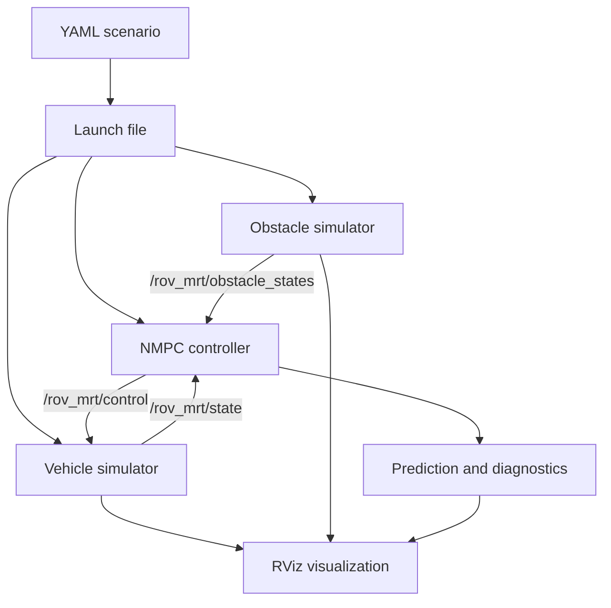

# ROS 2 architecture

| Topic | Type | Producer | Main consumer |
|---|---|---|---|
| `/rov_mrt/state` | `std_msgs/Float64MultiArray` | vehicle simulator | NMPC, visualization |
| `/rov_mrt/control` | `std_msgs/Float64MultiArray` | NMPC | vehicle simulator |
| `/rov_mrt/obstacle_states` | `std_msgs/Float64MultiArray` | obstacle simulator | NMPC |
| `/predicted_path` | `nav_msgs/Path` | NMPC | RViz |
| `/nmpc/diagnostics` | `std_msgs/Float64MultiArray` | NMPC | recorder/analysis |
| `/nmpc/solve_time` | `std_msgs/Float64` | NMPC | recorder |

Array layouts are documented in `docs/reproduction.md`. A future deployment
should replace untyped numeric arrays with custom timestamped messages so that
field meaning, units, and synchronization are explicit.
